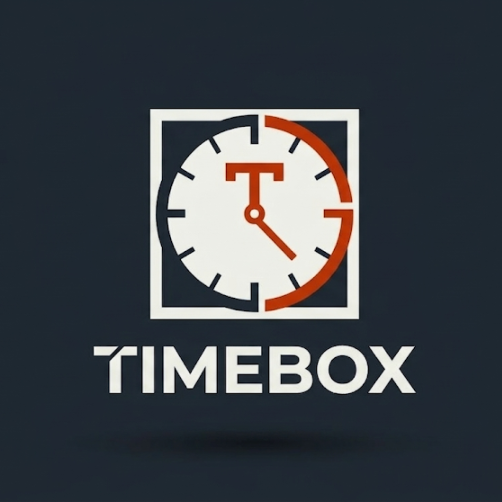
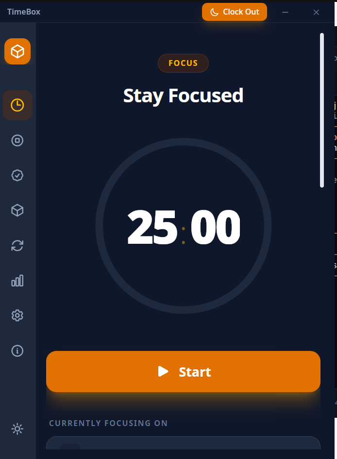
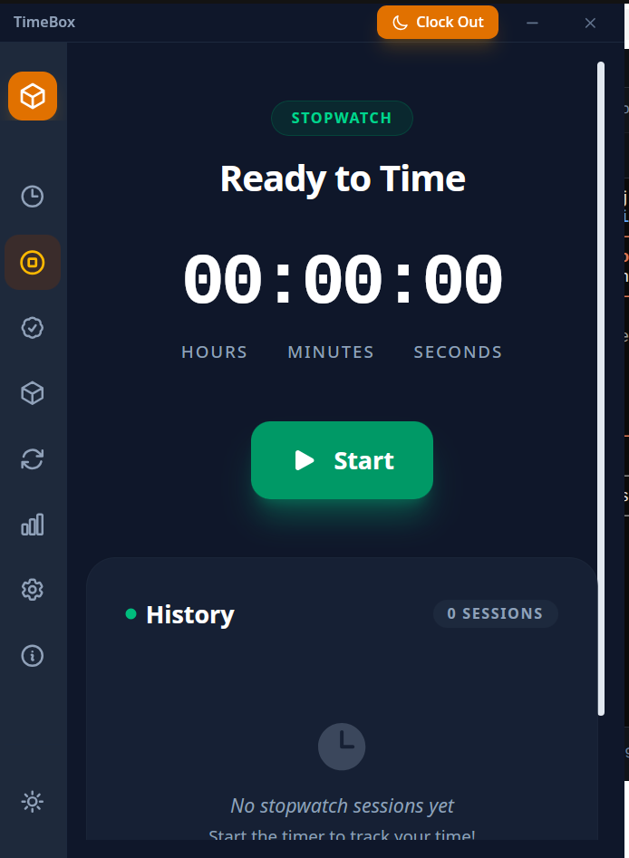
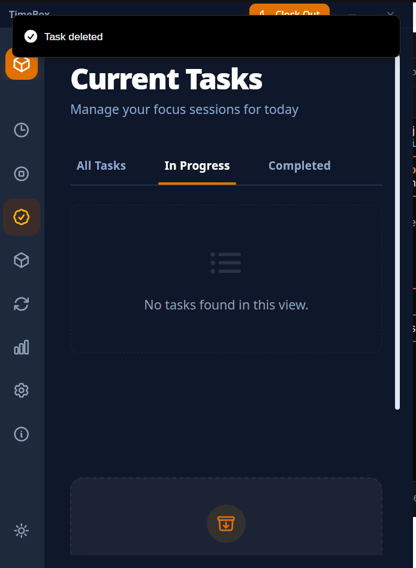
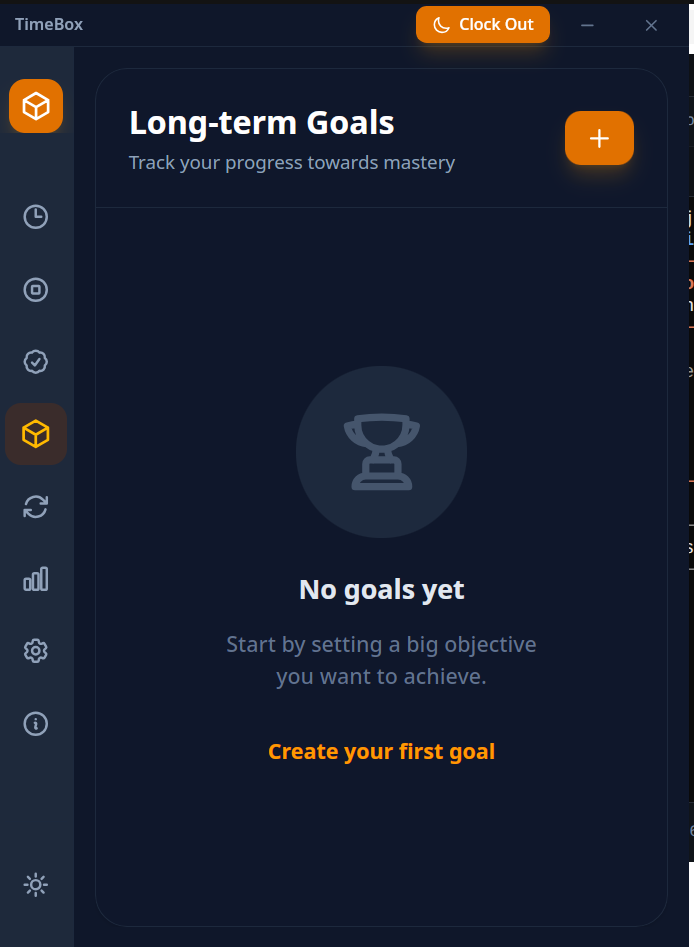
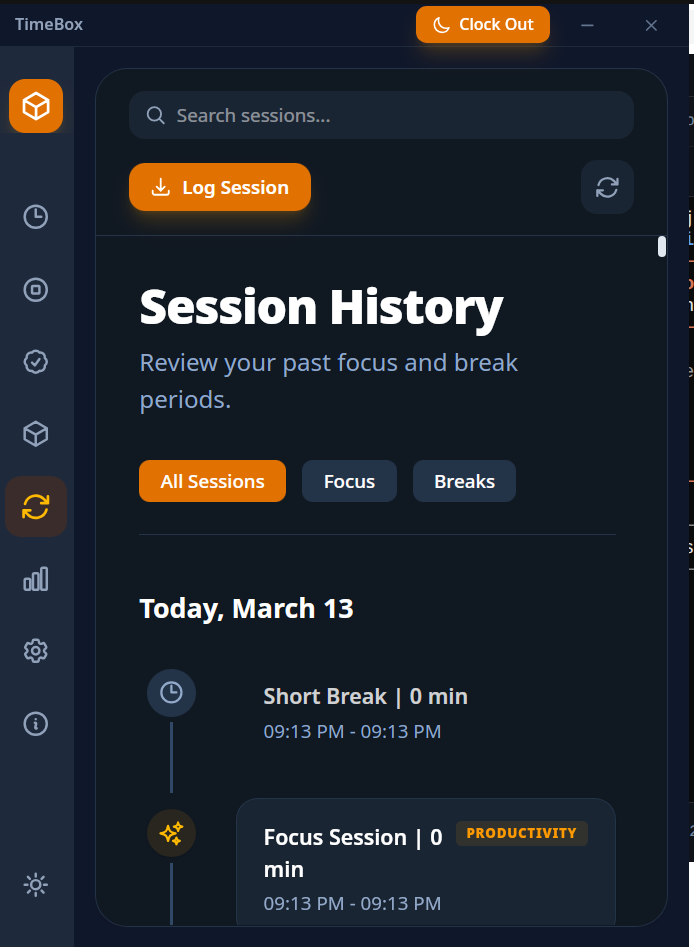

<div align="center">



# TimeBox

### Own Your Time. Master Your Focus.

A powerful, cross-platform desktop productivity app that uses the Pomodoro Technique to help you work smarter, track progress, and build lasting focus habits.

[](https://tauri.app/)
[](https://react.dev/)
[](https://www.typescriptlang.org/)
[](https://www.rust-lang.org/)
[](LICENSE)

**Windows** | **macOS** | **Linux**

---

</div>

## Why TimeBox?

Most timer apps just count down. **TimeBox is a complete productivity system.** It combines a Pomodoro timer, task management, goal tracking, session analytics, daily reflections, and a stopwatch into one elegant native desktop app. Everything stays on your machine — no accounts, no cloud, no subscriptions. Just focus.

- **Stay in flow** — Structured focus/break cycles backed by the Pomodoro Technique
- **See your patterns** — Heatmaps and analytics reveal when you do your best work
- **Track what matters** — Link tasks and long-term goals to every minute you invest
- **Reflect and grow** — End-of-day clockout with mood and productivity journaling
- **Your data, your machine** — 100% local SQLite storage, zero telemetry

---

## Screenshots

<div align="center">

| Focus Timer | Stopwatch |
|:-:|:-:|
|  |  |

| Task Manager | Long-term Goals |
|:-:|:-:|
|  |  |



*Session History — review every focus and break period*

</div>

---

## Features

### Pomodoro Timer
- Customizable focus duration (default 25 min), short breaks (5 min), and long breaks (15 min)
- Configurable cycles before a long break (default 4)
- Large circular countdown display with progress ring
- Play, pause, resume, and stop controls
- Link any task to your current session
- Audio notifications on session completion
- **Strict Mode** — prevents skipping sessions for disciplined work
- **Auto-start breaks** — seamlessly transition from focus to rest

### Stopwatch
- Free-form time tracking for tasks that don't fit a Pomodoro
- Label sessions for easy identification
- Full session history with timestamps

### Task Management
- Create tasks with titles and estimated Pomodoro counts
- Filter by All / In Progress / Completed
- Edit, complete, or delete tasks
- Real-time tracking of actual vs. estimated Pomodoros
- Quick-select tasks during an active timer session

### Long-term Goals
- Set goals with target Pomodoro counts and deadlines
- Add categories, descriptions, and personal motivations
- Track cumulative progress over time
- View detailed progress or manage goals from a list

### Session History
- Chronological log of every focus session, short break, and long break
- Grouped by date with search and filtering (All Sessions / Focus / Breaks)
- View duration, start/end times, interruption counts, and linked tasks
- **Manual session entry** — log past work you forgot to time

### Analytics Dashboard
- **Focus heatmap** — 7-day x 24-hour grid showing when you're most productive
- Peak productivity hours identification
- Daily focus time totals and trends (7-day, 30-day, custom range)
- Pomodoros-per-task breakdown
- Break compliance and flow-state quality metrics
- Optimization insights and recommendations

### Daily Reflections
- End-of-day **Clock Out** flow with mood and productivity ratings
- Duration reflection, purpose reflection, and free-form notes
- Calendar view of past reflections
- Daily timeline showing all sessions and completed tasks chronologically

### Settings & Customization
- **Timer** — adjust all durations, cycle count, strict mode, auto-start
- **Sound** — toggle notifications, adjust volume (0–100%)
- **Theme** — dark / light mode with system detection
- **Data** — all data stored locally in SQLite, no account required

---

## Tech Stack

| Layer | Technology | Purpose |
|-------|-----------|---------|
| **Desktop Shell** | [Tauri 2](https://tauri.app/) | Lightweight native wrapper (Rust + system WebView) |
| **Frontend** | [React 19](https://react.dev/) + [TypeScript 5.8](https://www.typescriptlang.org/) | Component-based UI with full type safety |
| **Styling** | [Tailwind CSS 4](https://tailwindcss.com/) | Utility-first styling |
| **Animations** | [Framer Motion](https://www.framer.com/motion/) | Smooth, production-ready transitions |
| **State** | [Jotai](https://jotai.org/) | Atomic state management (140+ atoms) |
| **Database** | SQLite via [SQLx](https://github.com/launchbadge/sqlx) | Async, type-safe local persistence |
| **Backend** | Rust 2021 + [Tokio](https://tokio.rs/) | Async command handlers and data layer |
| **Build** | [Vite 7](https://vitejs.dev/) | Fast HMR dev server and optimized production builds |
| **Icons** | [Heroicons](https://heroicons.com/) | Clean, consistent iconography |
| **Notifications** | [Sonner](https://sonner.emilkowal.ski/) | Elegant toast notifications |
| **Dates** | [date-fns](https://date-fns.org/) | Functional date utilities |

---

## Installation

### Download Pre-built Release

Head to the [Releases](https://github.com/yourusername/timebox/releases) page and download the installer for your platform:

| Platform | File | Notes |
|----------|------|-------|
| **Windows** | `TimeBox_x.x.x_x64-setup.exe` | Windows 10/11 (64-bit) |
| **macOS** | `TimeBox_x.x.x_x64.dmg` | macOS 10.15+ (Intel & Apple Silicon) |
| **Ubuntu/Debian** | `TimeBox_x.x.x_amd64.deb` | Ubuntu 20.04+ / Debian 11+ |
| **Linux (any)** | `TimeBox_x.x.x_amd64.AppImage` | Portable, runs on most distros |

---

### Install from Pre-built Packages

#### Windows

1. Download `TimeBox_x.x.x_x64-setup.exe` from [Releases](https://github.com/yourusername/timebox/releases)
2. Double-click the installer and follow the setup wizard
3. If Windows SmartScreen appears, click **"More info"** then **"Run anyway"** (the app is not code-signed yet)
4. Launch TimeBox from the Start Menu or Desktop shortcut

To uninstall, use **Settings > Apps > TimeBox > Uninstall** or run the uninstaller from the install directory.

#### macOS

1. Download `TimeBox_x.x.x_x64.dmg` from [Releases](https://github.com/yourusername/timebox/releases)
2. Open the `.dmg` file and drag **TimeBox** into your **Applications** folder
3. On first launch, macOS may block the app. Go to **System Settings > Privacy & Security** and click **"Open Anyway"**
4. Launch TimeBox from the Applications folder or Spotlight

To uninstall, drag TimeBox from Applications to the Trash.

#### Ubuntu / Debian

**Option A — .deb package (recommended):**

```bash
# Download the .deb package from Releases, then:
sudo dpkg -i TimeBox_x.x.x_amd64.deb

# If there are missing dependencies:
sudo apt-get install -f
```

Launch from your application menu or run `timebox-main` from the terminal.

To uninstall:

```bash
sudo dpkg -r timebox-main
```

**Option B — AppImage (portable, no install):**

```bash
# Download the AppImage from Releases, then:
chmod +x TimeBox_x.x.x_amd64.AppImage
./TimeBox_x.x.x_amd64.AppImage
```

No installation needed — the AppImage runs directly. To "uninstall", simply delete the file.

---

### Build from Source

Building from source is required for development or if a pre-built binary isn't available for your platform.

#### Prerequisites

| Requirement | Version | Install Guide |
|-------------|---------|---------------|
| **Node.js** | v18+ | [nodejs.org](https://nodejs.org/) |
| **npm** | v9+ | Included with Node.js |
| **Rust** | latest stable | [rustup.rs](https://rustup.rs/) |
| **Tauri CLI** | v2 | Installed automatically via npm |

#### Platform-specific build dependencies

<details>
<summary><strong>Windows</strong></summary>

Install the following via the Visual Studio Installer:

- **Microsoft Visual C++ Build Tools** (Desktop development with C++)
- **Windows 10/11 SDK**

Or install [Visual Studio 2022 Community](https://visualstudio.microsoft.com/) with the "Desktop development with C++" workload.

WebView2 is included on Windows 10 (version 1803+) and Windows 11 by default.

</details>

<details>
<summary><strong>macOS</strong></summary>

```bash
# Install Xcode Command Line Tools
xcode-select --install
```

That's it — macOS includes WebView (WKWebView) and all required build tools.

</details>

<details>
<summary><strong>Ubuntu / Debian</strong></summary>

```bash
sudo apt update
sudo apt install -y \
  libwebkit2gtk-4.1-dev \
  build-essential \
  curl \
  wget \
  file \
  libxdo-dev \
  libssl-dev \
  libayatana-appindicator3-dev \
  librsvg2-dev
```

</details>

#### Build Steps

```bash
# 1. Clone the repository
git clone https://github.com/yourusername/timebox.git
cd timebox

# 2. Install frontend dependencies
npm install

# 3. Run in development mode (hot-reload)
npm run tauri dev

# 4. Build for production (creates native installer in src-tauri/target/release/bundle/)
npm run tauri build
```

After building, platform-specific installers are generated at:

```
src-tauri/target/release/bundle/
├── deb/        # .deb package (Ubuntu/Debian)
├── appimage/   # .AppImage (portable Linux)
├── msi/        # .msi installer (Windows)
├── nsis/       # .exe installer (Windows)
└── dmg/        # .dmg disk image (macOS)
```

---

## Usage

### Quick Start

1. **Launch TimeBox** — the splash screen appears briefly, then the main window opens
2. **Create tasks** — go to the Tasks tab and add what you're working on with Pomodoro estimates
3. **Start a session** — switch to the Timer tab, select a task, and hit **Start**
4. **Focus** — work until the timer completes (25 minutes by default)
5. **Take a break** — TimeBox transitions to a break screen with rest suggestions
6. **Repeat** — after 4 cycles, take a longer break to recharge
7. **Clock Out** — at the end of your day, hit **Clock Out** to log your mood and reflections

### Daily Workflow

| Step | Where | What |
|------|-------|------|
| Plan | Tasks tab | Create tasks, estimate Pomodoros |
| Focus | Timer tab | Select task, run Pomodoro cycles |
| Rest | Break page | Follow suggested break activities |
| Track | History tab | Review completed sessions |
| Analyze | Analytics tab | Study your heatmap and trends |
| Reflect | Clock Out button | Rate your mood, log notes |

### Navigation

TimeBox uses a sidebar with icon-based navigation:

| Icon | Tab | Description |
|------|-----|-------------|
| Timer | **Focus Timer** | Pomodoro countdown with task linking |
| Stopwatch | **Stopwatch** | Free-form time tracking |
| Tasks | **Tasks** | Create and manage work items |
| Goals | **Goals** | Long-term objective tracking |
| History | **Session History** | Browse past sessions |
| Analytics | **Analytics** | Heatmaps, trends, and insights |
| Settings | **Settings** | Customize durations, sound, theme |
| Info | **About** | App version and information |

---

## Architecture

```
┌─────────────────────────────────────────────┐
│                   TimeBox                    │
├──────────────────┬──────────────────────────┤
│   React 19 UI    │    Tauri IPC Bridge      │
│  (Vite + TS)     │    invoke() / listen()   │
│                  │                          │
│  Jotai Atoms ◄───┼──► commands.rs (Rust)    │
│  140+ atoms      │    30+ IPC handlers      │
│                  │                          │
│  Components      │    database.rs           │
│  25+ screens     │    SQLx async queries    │
├──────────────────┼──────────────────────────┤
│     Tailwind     │   SQLite (local file)    │
│  Framer Motion   │   7 tables, UUID PKs     │
└──────────────────┴──────────────────────────┘
```

**Frontend** — React components read/write Jotai atoms. API calls go through `apiService.ts`, which wraps Tauri's `invoke()` IPC mechanism.

**Backend** — Rust command handlers in `commands.rs` process requests, manage active session state via `AppState` (with `RwLock`), and persist data through the SQLx database layer.

**Database** — SQLite with 7 tables: `users`, `pomodoro_settings`, `tasks`, `pomodoro_sessions`, `goals`, `daily_reflections`, and `stopwatch_sessions`. All data stays in the app's local data directory.

---

## Project Structure

```
timebox-main/
├── src/                        # React + TypeScript frontend
│   ├── App.tsx                 # Root layout, routing, theme
│   ├── atoms.ts                # Jotai global state (140+ atoms)
│   ├── types.ts                # TypeScript interfaces
│   ├── apiService.ts           # Tauri IPC bridge
│   ├── PomodoroTimer.tsx       # Focus timer screen
│   ├── StopwatchTimer.tsx      # Stopwatch screen
│   ├── TaskManager.tsx         # Task CRUD
│   ├── GoalsManager.tsx        # Goals list
│   ├── SessionHistory.tsx      # Session log
│   ├── AnalyticsDashboard.tsx  # Analytics + heatmap
│   ├── SettingsPanel.tsx       # Configuration
│   ├── BreakPage.tsx           # Break screen
│   ├── ClockoutModal.tsx       # Daily reflection
│   ├── DailyTimeline.tsx       # Activity timeline
│   ├── components/             # Reusable UI components
│   └── assets/                 # Audio files, images
├── src-tauri/                  # Rust backend
│   ├── src/
│   │   ├── commands.rs         # IPC command handlers
│   │   ├── database.rs         # SQLx data layer
│   │   └── database_schema.sql # Schema + migrations
│   ├── tauri.conf.json         # Tauri configuration
│   └── icons/                  # App icons (all platforms)
├── public/                     # Static assets
│   ├── splash.png              # Splash screen image
│   └── splashscreen.html       # Splash screen page
├── snapshot/                   # App screenshots
├── package.json                # Frontend dependencies
├── tailwind.config.js          # Tailwind configuration
└── vite.config.ts              # Vite build configuration
```

---

## Contributing

Contributions are welcome! To get started:

1. Fork the repository
2. Create a feature branch: `git checkout -b feature/your-feature`
3. Make your changes with clear commit messages
4. Ensure TypeScript compiles without errors: `npx tsc --noEmit`
5. Submit a pull request to `main`

**Areas where help is appreciated:**
- UI/UX refinements and accessibility improvements
- Additional analytics visualizations
- Internationalization (i18n) support
- Performance optimization
- Test coverage

---

## License

This project is licensed under the **MIT License** — see the [LICENSE](LICENSE) file for details.

---

<div align="center">


**TimeBox** — Transform your time into focus.

[Report a Bug](https://github.com/yourusername/timebox/issues) | [Request a Feature](https://github.com/yourusername/timebox/issues)

</div>
